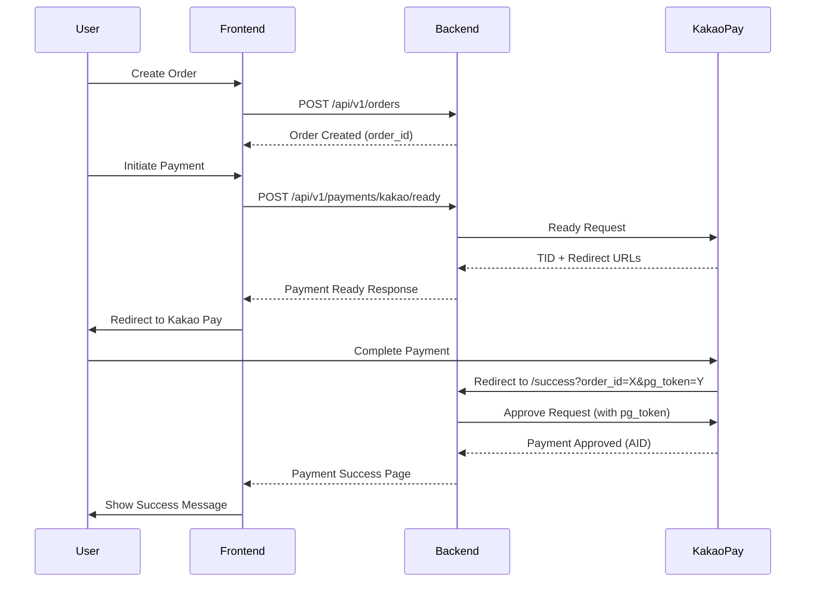

# Kakao Pay Integration Guide

Complete implementation guide for integrating Kakao Pay payment system into the Udonggeum frontend application.

## Table of Contents

1. [Overview](#overview)
2. [Architecture](#architecture)
3. [Prerequisites](#prerequisites)
4. [Backend API Reference](#backend-api-reference)
5. [Implementation Steps](#implementation-steps)
   - [Step 1: Update Type Definitions](#step-1-update-type-definitions)
   - [Step 2: Create Payment Service](#step-2-create-payment-service)
   - [Step 3: Create React Query Hooks](#step-3-create-react-query-hooks)
   - [Step 4: Update API Constants](#step-4-update-api-constants)
   - [Step 5: Create Payment Pages](#step-5-create-payment-pages)
   - [Step 6: Update Routing](#step-6-update-routing)
   - [Step 7: Modify Order Flow](#step-7-modify-order-flow)
   - [Step 8: Add Payment Status Display](#step-8-add-payment-status-display)
6. [Testing](#testing)
7. [Troubleshooting](#troubleshooting)
8. [Best Practices](#best-practices)

---

## Overview

### What is Kakao Pay?

Kakao Pay is South Korea's leading mobile payment service, integrated with KakaoTalk. This guide implements a redirect-based payment flow where:

1. User completes order in your application
2. User is redirected to Kakao Pay for payment
3. User completes payment in Kakao Pay
4. User is redirected back to your application
5. Your backend automatically approves the payment

### Payment Flow Diagram



### Technology Stack

- **React 19** with TypeScript
- **TanStack Query (React Query)** for server state management
- **Zustand** for local state
- **Zod** for schema validation
- **Axios** for HTTP requests
- **React Router** for navigation
- **DaisyUI + TailwindCSS** for UI components

---

## Architecture

### Directory Structure

```
src/
├── api/
│   └── client.ts                    # Axios instance (already exists)
├── components/
│   ├── PaymentStatusBadge.tsx       # NEW: Payment status display
│   └── OrderStatusBadge.tsx         # UPDATE: Add payment status
├── pages/
│   ├── OrderPage.tsx                # UPDATE: Redirect to payment
│   ├── PaymentPage.tsx              # NEW: Initiate payment
│   ├── PaymentSuccessPage.tsx       # NEW: Handle success callback
│   ├── PaymentFailPage.tsx          # NEW: Handle failure
│   └── PaymentCancelPage.tsx        # NEW: Handle cancellation
├── services/
│   ├── payment.ts                   # NEW: Payment API service
│   └── orders.ts                    # UPDATE: Add payment fields
├── hooks/
│   └── queries/
│       └── usePaymentQueries.ts     # NEW: Payment React Query hooks
├── schemas/
│   ├── payment.ts                   # NEW: Payment schemas
│   └── orders.ts                    # UPDATE: Add payment fields
├── constants/
│   └── api.ts                       # UPDATE: Add payment endpoints
└── types/
    └── index.ts                     # UPDATE: Add payment types
```

---

## Prerequisites

### Required

- ✅ Backend payment API endpoints implemented (already done)
- ✅ React 19 + TypeScript environment
- ✅ TanStack Query configured
- ✅ Axios client with interceptors
- ✅ React Router setup

### Environment Variables

Ensure your `.env.development` has:

```bash
VITE_API_BASE_URL=          # Empty for proxy or http://localhost:8080
VITE_PROXY_TARGET=http://localhost:8080
```

---

## Backend API Reference

### 1. Initiate Payment (Ready)

**Endpoint**: `POST /api/v1/payments/kakao/ready`

**Request**:
```typescript
{
  "order_id": 1
}
```

**Response** (200 OK):
```typescript
{
  "message": "Payment initiated successfully",
  "data": {
    "tid": "T91ca88177920788c115",                    // Transaction ID
    "next_redirect_pc_url": "https://online-payment.kakaopay.com/...",
    "next_redirect_mobile_url": "https://online-payment.kakaopay.com/...",
    "next_redirect_app_url": "https://online-payment.kakaopay.com/...",
    "android_app_scheme": "kakaotalk://kakaopay/pg?url=...",
    "ios_app_scheme": "kakaotalk://kakaopay/pg?url=..."
  }
}
```

**Error Responses**:
- `401`: Not authenticated
- `404`: Order not found
- `409`: Payment already processed
- `400`: Invalid payment amount
- `500`: Kakao Pay API error

---

### 2. Payment Success Callback

**Endpoint**: `GET /api/v1/payments/kakao/success`

**Query Parameters**:
- `order_id`: number (automatically added by backend)
- `pg_token`: string (provided by Kakao Pay)

**Response** (200 OK):
```typescript
{
  "message": "Payment completed successfully",
  "data": {
    "order_id": 1,
    "aid": "A91ca930315e2b03efce",           // Approval ID
    "tid": "T91ca901315e2b03efcd",           // Transaction ID
    "total_amount": 1960000,
    "payment_method": "MONEY",                // CARD, MONEY
    "approved_at": "2025-11-19T02:13:20Z"
  }
}
```

**Note**: This endpoint is called by Kakao Pay redirect. Your frontend will display this response to the user.

---

### 3. Payment Failure Callback

**Endpoint**: `GET /api/v1/payments/kakao/fail`

**Query Parameters**:
- `order_id`: number
- `error_msg`: string (optional, from Kakao Pay)

**Response** (200 OK):
```typescript
{
  "message": "Payment failed",
  "error": "결제 실패 사유"
}
```

---

### 4. Payment Cancellation Callback

**Endpoint**: `GET /api/v1/payments/kakao/cancel`

**Query Parameters**:
- `order_id`: number

**Response** (200 OK):
```typescript
{
  "message": "Payment cancelled by user"
}
```

---

### 5. Get Payment Status

**Endpoint**: `GET /api/v1/payments/kakao/status/:orderID`

**Response** (200 OK):
```typescript
{
  "message": "Payment status retrieved successfully",
  "data": {
    "order_id": 1,
    "payment_status": "completed",           // pending, completed, failed, refunded
    "payment_provider": "kakaopay",
    "payment_tid": "T91ca901315e2b03efcd",
    "payment_aid": "A91ca930315e2b03efce",
    "payment_approved_at": "2025-11-19T02:13:20Z",
    "total_amount": 1960000
  }
}
```

---

### 6. Refund Payment

**Endpoint**: `POST /api/v1/payments/kakao/:orderID/refund`

**Request**:
```typescript
{
  "cancel_amount": 1960000  // Amount to refund (full or partial)
}
```

**Response** (200 OK):
```typescript
{
  "message": "Payment cancelled successfully",
  "data": {
    "order_id": 1,
    "tid": "T91ca901315e2b03efcd",
    "canceled_amount": 1960000,
    "remaining_amount": 0,
    "canceled_at": "2025-11-19T02:20:00Z"
  }
}
```

---

## Implementation Steps

### Step 1: Update Type Definitions

#### 1.1 Create Payment Schemas

**File**: `src/schemas/payment.ts` (NEW)

```typescript
import { z } from 'zod';

// Payment Ready Request
export const PaymentReadyRequestSchema = z.object({
  order_id: z.number().int().positive(),
});

export type PaymentReadyRequest = z.infer<typeof PaymentReadyRequestSchema>;

// Payment Ready Response
export const PaymentReadyResponseSchema = z.object({
  message: z.string(),
  data: z.object({
    tid: z.string(),
    next_redirect_pc_url: z.string().url(),
    next_redirect_mobile_url: z.string().url(),
    next_redirect_app_url: z.string().url(),
    android_app_scheme: z.string(),
    ios_app_scheme: z.string(),
  }),
});

export type PaymentReadyResponse = z.infer<typeof PaymentReadyResponseSchema>;

// Payment Approval Response
export const PaymentApprovalResponseSchema = z.object({
  message: z.string(),
  data: z.object({
    order_id: z.number(),
    aid: z.string(),
    tid: z.string(),
    total_amount: z.number(),
    payment_method: z.enum(['CARD', 'MONEY']),
    approved_at: z.string().datetime(),
  }),
});

export type PaymentApprovalResponse = z.infer<typeof PaymentApprovalResponseSchema>;

// Payment Status Response
export const PaymentStatusResponseSchema = z.object({
  message: z.string(),
  data: z.object({
    order_id: z.number(),
    payment_status: z.enum(['pending', 'completed', 'failed', 'refunded']),
    payment_provider: z.string().optional(),
    payment_tid: z.string().optional(),
    payment_aid: z.string().optional(),
    payment_approved_at: z.string().datetime().nullable().optional(),
    total_amount: z.number(),
  }),
});

export type PaymentStatusResponse = z.infer<typeof PaymentStatusResponseSchema>;

// Payment Refund Request
export const PaymentRefundRequestSchema = z.object({
  cancel_amount: z.number().positive(),
});

export type PaymentRefundRequest = z.infer<typeof PaymentRefundRequestSchema>;

// Payment Refund Response
export const PaymentRefundResponseSchema = z.object({
  message: z.string(),
  data: z.object({
    order_id: z.number(),
    tid: z.string(),
    canceled_amount: z.number(),
    remaining_amount: z.number(),
    canceled_at: z.string().datetime(),
  }),
});

export type PaymentRefundResponse = z.infer<typeof PaymentRefundResponseSchema>;

// Payment Error Response
export const PaymentErrorResponseSchema = z.object({
  message: z.string(),
  error: z.string().optional(),
});

export type PaymentErrorResponse = z.infer<typeof PaymentErrorResponseSchema>;
```

#### 1.2 Update Order Schema

**File**: `src/schemas/orders.ts` (UPDATE)

Add payment-related fields to your existing `OrderSchema`:

```typescript
export const OrderSchema = z.object({
  // ... existing fields (id, user_id, total_amount, etc.)

  // ADD these payment fields:
  payment_status: z.enum(['pending', 'completed', 'failed', 'refunded']),
  payment_provider: z.string().optional(),
  payment_tid: z.string().optional(),
  payment_aid: z.string().optional(),
  payment_approved_at: z.string().datetime().nullable().optional(),

  // ... rest of existing fields
});
```

---

### Step 2: Create Payment Service

**File**: `src/services/payment.ts` (NEW)

```typescript
import apiClient from '../api/client';
import { API_CONFIG } from '../constants/api';
import {
  PaymentReadyRequest,
  PaymentReadyRequestSchema,
  PaymentReadyResponse,
  PaymentReadyResponseSchema,
  PaymentApprovalResponse,
  PaymentApprovalResponseSchema,
  PaymentStatusResponse,
  PaymentStatusResponseSchema,
  PaymentRefundRequest,
  PaymentRefundRequestSchema,
  PaymentRefundResponse,
  PaymentRefundResponseSchema,
} from '../schemas/payment';

/**
 * Payment Service
 * Handles all Kakao Pay payment-related API calls
 */
class PaymentService {
  /**
   * Initiate Kakao Pay payment
   * Returns redirect URLs to Kakao Pay payment page
   */
  async initiateKakaoPay(
    request: PaymentReadyRequest
  ): Promise<PaymentReadyResponse> {
    // Validate request
    const validatedRequest = PaymentReadyRequestSchema.parse(request);

    // Call backend API
    const response = await apiClient.post(
      API_CONFIG.ENDPOINTS.PAYMENTS.KAKAO.READY,
      validatedRequest
    );

    // Validate and return response
    return PaymentReadyResponseSchema.parse(response.data);
  }

  /**
   * Get payment status for an order
   */
  async getPaymentStatus(orderId: number): Promise<PaymentStatusResponse> {
    const response = await apiClient.get(
      API_CONFIG.ENDPOINTS.PAYMENTS.KAKAO.STATUS(orderId)
    );

    return PaymentStatusResponseSchema.parse(response.data);
  }

  /**
   * Refund/cancel a payment
   */
  async refundPayment(
    orderId: number,
    request: PaymentRefundRequest
  ): Promise<PaymentRefundResponse> {
    // Validate request
    const validatedRequest = PaymentRefundRequestSchema.parse(request);

    // Call backend API
    const response = await apiClient.post(
      API_CONFIG.ENDPOINTS.PAYMENTS.KAKAO.REFUND(orderId),
      validatedRequest
    );

    // Validate and return response
    return PaymentRefundResponseSchema.parse(response.data);
  }

  /**
   * Handle payment success callback
   * This is called when Kakao Pay redirects back to success page
   * The backend automatically approves the payment
   */
  async handlePaymentSuccess(
    orderId: number,
    pgToken: string
  ): Promise<PaymentApprovalResponse> {
    const response = await apiClient.get(
      API_CONFIG.ENDPOINTS.PAYMENTS.KAKAO.SUCCESS,
      {
        params: { order_id: orderId, pg_token: pgToken },
      }
    );

    return PaymentApprovalResponseSchema.parse(response.data);
  }
}

// Export singleton instance
export const paymentService = new PaymentService();
```

---

### Step 3: Create React Query Hooks

**File**: `src/hooks/queries/usePaymentQueries.ts` (NEW)

```typescript
import { useMutation, useQuery, useQueryClient } from '@tanstack/react-query';
import { paymentService } from '../../services/payment';
import type {
  PaymentReadyRequest,
  PaymentRefundRequest,
} from '../../schemas/payment';
import { ordersKeys } from './useOrdersQueries';

/**
 * Query Keys Factory
 * Centralized query key management for React Query
 */
export const paymentKeys = {
  all: ['payments'] as const,
  status: (orderId: number) => [...paymentKeys.all, 'status', orderId] as const,
};

/**
 * Hook: Initiate Kakao Pay payment
 * Usage: User clicks "Pay" button
 *
 * @example
 * const { mutate: initiatePayment, isPending } = useInitiateKakaoPay();
 *
 * initiatePayment({ order_id: 123 }, {
 *   onSuccess: (data) => {
 *     // Redirect to Kakao Pay
 *     window.location.href = data.data.next_redirect_pc_url;
 *   }
 * });
 */
export function useInitiateKakaoPay() {
  return useMutation({
    mutationFn: (request: PaymentReadyRequest) =>
      paymentService.initiateKakaoPay(request),
    onError: (error) => {
      console.error('Payment initiation failed:', error);
    },
  });
}

/**
 * Hook: Get payment status
 * Usage: Check order payment status
 *
 * @example
 * const { data, isLoading } = usePaymentStatus(orderId);
 */
export function usePaymentStatus(orderId: number) {
  return useQuery({
    queryKey: paymentKeys.status(orderId),
    queryFn: () => paymentService.getPaymentStatus(orderId),
    enabled: !!orderId, // Only fetch if orderId exists
    staleTime: 1000 * 60 * 5, // 5 minutes
    retry: 3,
  });
}

/**
 * Hook: Handle payment success callback
 * Usage: Called from PaymentSuccessPage with pg_token from URL
 *
 * @example
 * const { mutate: approvePayment } = useHandlePaymentSuccess();
 *
 * approvePayment({ orderId: 123, pgToken: 'abc123' }, {
 *   onSuccess: (data) => {
 *     // Show success message
 *   }
 * });
 */
export function useHandlePaymentSuccess() {
  const queryClient = useQueryClient();

  return useMutation({
    mutationFn: ({ orderId, pgToken }: { orderId: number; pgToken: string }) =>
      paymentService.handlePaymentSuccess(orderId, pgToken),
    onSuccess: (data, variables) => {
      // Invalidate order queries to refresh order list
      queryClient.invalidateQueries({ queryKey: ordersKeys.all });

      // Invalidate payment status
      queryClient.invalidateQueries({
        queryKey: paymentKeys.status(variables.orderId),
      });
    },
  });
}

/**
 * Hook: Refund payment
 * Usage: Admin or user requests refund
 *
 * @example
 * const { mutate: refundPayment } = useRefundPayment(orderId);
 *
 * refundPayment({ cancel_amount: 10000 }, {
 *   onSuccess: () => {
 *     // Show refund success message
 *   }
 * });
 */
export function useRefundPayment(orderId: number) {
  const queryClient = useQueryClient();

  return useMutation({
    mutationFn: (request: PaymentRefundRequest) =>
      paymentService.refundPayment(orderId, request),
    onSuccess: () => {
      // Invalidate related queries
      queryClient.invalidateQueries({ queryKey: ordersKeys.all });
      queryClient.invalidateQueries({ queryKey: paymentKeys.status(orderId) });
    },
  });
}
```

---

### Step 4: Update API Constants

**File**: `src/constants/api.ts` (UPDATE)

Add payment endpoints to your existing `API_CONFIG`:

```typescript
export const API_CONFIG = {
  // ... existing config

  ENDPOINTS: {
    // ... existing endpoints (AUTH, STORES, PRODUCTS, CART, ORDERS, ADDRESSES)

    // ADD this:
    PAYMENTS: {
      KAKAO: {
        READY: '/api/v1/payments/kakao/ready',
        SUCCESS: '/api/v1/payments/kakao/success',
        FAIL: '/api/v1/payments/kakao/fail',
        CANCEL: '/api/v1/payments/kakao/cancel',
        STATUS: (orderId: number) => `/api/v1/payments/kakao/status/${orderId}`,
        REFUND: (orderId: number) => `/api/v1/payments/kakao/${orderId}/refund`,
      },
    },
  },
} as const;
```

---

### Step 5: Create Payment Pages

#### 5.1 Payment Initiation Page

**File**: `src/pages/PaymentPage.tsx` (NEW)

```typescript
import { useEffect } from 'react';
import { useNavigate, useParams } from 'react-router-dom';
import { ShieldCheck, CreditCard, Loader2 } from 'lucide-react';
import { useInitiateKakaoPay, usePaymentStatus } from '../hooks/queries/usePaymentQueries';
import { useOrderDetail } from '../hooks/queries/useOrdersQueries';
import LoadingSpinner from '../components/LoadingSpinner';
import ErrorAlert from '../components/ErrorAlert';
import Button from '../components/Button';

/**
 * Payment Page
 * Displays order summary and initiates Kakao Pay payment
 */
export default function PaymentPage() {
  const { orderId } = useParams<{ orderId: string }>();
  const navigate = useNavigate();

  const orderIdNum = orderId ? parseInt(orderId, 10) : 0;

  // Fetch order details
  const {
    data: orderData,
    isLoading: isLoadingOrder,
    error: orderError,
  } = useOrderDetail(orderIdNum);

  // Check payment status
  const {
    data: paymentStatus,
    isLoading: isLoadingPayment,
  } = usePaymentStatus(orderIdNum);

  // Payment initiation mutation
  const {
    mutate: initiatePayment,
    isPending: isInitiating,
    error: paymentError,
  } = useInitiateKakaoPay();

  // Redirect if payment already completed
  useEffect(() => {
    if (paymentStatus?.data.payment_status === 'completed') {
      navigate(`/mypage`, { replace: true });
    }
  }, [paymentStatus, navigate]);

  // Handle payment button click
  const handlePayment = () => {
    initiatePayment(
      { order_id: orderIdNum },
      {
        onSuccess: (response) => {
          // Redirect to Kakao Pay
          // Use PC URL for desktop, mobile URL for mobile devices
          const isMobile = /iPhone|iPad|iPod|Android/i.test(navigator.userAgent);
          const redirectUrl = isMobile
            ? response.data.next_redirect_mobile_url
            : response.data.next_redirect_pc_url;

          // Redirect to Kakao Pay
          window.location.href = redirectUrl;
        },
      }
    );
  };

  // Loading state
  if (isLoadingOrder || isLoadingPayment) {
    return (
      <div className="container mx-auto px-4 py-8">
        <LoadingSpinner />
      </div>
    );
  }

  // Error state
  if (orderError || !orderData) {
    return (
      <div className="container mx-auto px-4 py-8">
        <ErrorAlert message="주문 정보를 불러올 수 없습니다." />
        <Button onClick={() => navigate('/mypage')} className="mt-4">
          주문 내역으로 돌아가기
        </Button>
      </div>
    );
  }

  const order = orderData.order;

  return (
    <div className="container mx-auto px-4 py-8 max-w-2xl">
      <div className="card bg-base-100 shadow-xl">
        <div className="card-body">
          {/* Header */}
          <h2 className="card-title text-2xl mb-6">
            <CreditCard className="w-6 h-6" />
            결제하기
          </h2>

          {/* Order Summary */}
          <div className="space-y-4 mb-6">
            <div className="divider">주문 정보</div>

            <div className="flex justify-between">
              <span className="text-base-content/70">주문번호</span>
              <span className="font-semibold">#{order.id}</span>
            </div>

            <div className="flex justify-between">
              <span className="text-base-content/70">상품 수량</span>
              <span className="font-semibold">
                {order.order_items?.length || 0}개 상품
              </span>
            </div>

            <div className="flex justify-between">
              <span className="text-base-content/70">배송 방식</span>
              <span className="font-semibold">
                {order.fulfillment_type === 'delivery' ? '배송' : '매장 픽업'}
              </span>
            </div>

            {order.fulfillment_type === 'delivery' && (
              <div className="flex justify-between">
                <span className="text-base-content/70">배송지</span>
                <span className="font-semibold text-right max-w-xs truncate">
                  {order.shipping_address}
                </span>
              </div>
            )}

            <div className="divider">결제 금액</div>

            <div className="flex justify-between text-lg font-bold text-primary">
              <span>총 결제 금액</span>
              <span>{order.total_amount.toLocaleString()}원</span>
            </div>
          </div>

          {/* Payment Error */}
          {paymentError && (
            <ErrorAlert
              message={paymentError.message || '결제 요청 중 오류가 발생했습니다.'}
            />
          )}

          {/* Payment Method Info */}
          <div className="alert alert-info">
            <ShieldCheck className="w-5 h-5" />
            <div className="text-sm">
              <div className="font-semibold">카카오페이로 안전하게 결제하세요</div>
              <div className="text-xs mt-1">
                카카오페이 결제 페이지로 이동합니다
              </div>
            </div>
          </div>

          {/* Action Buttons */}
          <div className="card-actions justify-end mt-6">
            <Button
              variant="ghost"
              onClick={() => navigate('/mypage')}
              disabled={isInitiating}
            >
              취소
            </Button>
            <Button
              variant="primary"
              onClick={handlePayment}
              disabled={isInitiating}
              className="min-w-[120px]"
            >
              {isInitiating ? (
                <>
                  <Loader2 className="w-4 h-4 animate-spin mr-2" />
                  처리 중...
                </>
              ) : (
                '카카오페이 결제'
              )}
            </Button>
          </div>
        </div>
      </div>
    </div>
  );
}
```

#### 5.2 Payment Success Page

**File**: `src/pages/PaymentSuccessPage.tsx` (NEW)

```typescript
import { useEffect, useState } from 'react';
import { useNavigate, useSearchParams } from 'react-router-dom';
import { CheckCircle, Loader2, XCircle } from 'lucide-react';
import { useHandlePaymentSuccess } from '../hooks/queries/usePaymentQueries';
import LoadingSpinner from '../components/LoadingSpinner';
import Button from '../components/Button';

/**
 * Payment Success Page
 * Handles Kakao Pay success callback
 * URL: /payment/success?order_id=X&pg_token=Y
 */
export default function PaymentSuccessPage() {
  const [searchParams] = useSearchParams();
  const navigate = useNavigate();
  const [approvalData, setApprovalData] = useState<any>(null);

  const orderId = searchParams.get('order_id');
  const pgToken = searchParams.get('pg_token');

  const { mutate: approvePayment, isPending, error } = useHandlePaymentSuccess();

  // Auto-approve payment when page loads
  useEffect(() => {
    if (!orderId || !pgToken) {
      console.error('Missing required parameters');
      return;
    }

    const orderIdNum = parseInt(orderId, 10);
    if (isNaN(orderIdNum)) {
      console.error('Invalid order ID');
      return;
    }

    // Call backend to approve payment
    approvePayment(
      { orderId: orderIdNum, pgToken },
      {
        onSuccess: (data) => {
          setApprovalData(data.data);
        },
      }
    );
  }, [orderId, pgToken, approvePayment]);

  // Loading state
  if (isPending) {
    return (
      <div className="container mx-auto px-4 py-16">
        <div className="max-w-md mx-auto text-center">
          <LoadingSpinner />
          <p className="mt-4 text-lg">결제 승인 중입니다...</p>
          <p className="mt-2 text-sm text-base-content/60">
            잠시만 기다려주세요
          </p>
        </div>
      </div>
    );
  }

  // Error state
  if (error) {
    return (
      <div className="container mx-auto px-4 py-16">
        <div className="max-w-md mx-auto">
          <div className="card bg-base-100 shadow-xl">
            <div className="card-body items-center text-center">
              <XCircle className="w-16 h-16 text-error mb-4" />
              <h2 className="card-title text-2xl">결제 승인 실패</h2>
              <p className="text-base-content/70 mt-2">
                {error.message || '결제 승인 중 오류가 발생했습니다.'}
              </p>
              <div className="card-actions justify-center mt-6">
                <Button variant="ghost" onClick={() => navigate('/mypage')}>
                  주문 내역
                </Button>
                <Button
                  variant="primary"
                  onClick={() => navigate('/')}
                >
                  홈으로
                </Button>
              </div>
            </div>
          </div>
        </div>
      </div>
    );
  }

  // Success state
  if (approvalData) {
    return (
      <div className="container mx-auto px-4 py-16">
        <div className="max-w-md mx-auto">
          <div className="card bg-base-100 shadow-xl">
            <div className="card-body items-center text-center">
              <CheckCircle className="w-16 h-16 text-success mb-4" />
              <h2 className="card-title text-2xl">결제 완료!</h2>
              <p className="text-base-content/70 mt-2">
                결제가 성공적으로 완료되었습니다
              </p>

              {/* Payment Details */}
              <div className="w-full mt-6 space-y-3">
                <div className="divider">결제 정보</div>

                <div className="flex justify-between text-sm">
                  <span className="text-base-content/70">주문번호</span>
                  <span className="font-semibold">#{approvalData.order_id}</span>
                </div>

                <div className="flex justify-between text-sm">
                  <span className="text-base-content/70">결제 수단</span>
                  <span className="font-semibold">
                    {approvalData.payment_method === 'CARD'
                      ? '카드'
                      : '카카오머니'}
                  </span>
                </div>

                <div className="flex justify-between text-sm">
                  <span className="text-base-content/70">결제 금액</span>
                  <span className="font-semibold text-primary">
                    {approvalData.total_amount.toLocaleString()}원
                  </span>
                </div>

                <div className="flex justify-between text-sm">
                  <span className="text-base-content/70">거래번호</span>
                  <span className="font-mono text-xs">
                    {approvalData.tid}
                  </span>
                </div>

                <div className="flex justify-between text-sm">
                  <span className="text-base-content/70">승인시간</span>
                  <span className="text-xs">
                    {new Date(approvalData.approved_at).toLocaleString('ko-KR')}
                  </span>
                </div>
              </div>

              {/* Actions */}
              <div className="card-actions justify-center mt-8 w-full">
                <Button
                  variant="ghost"
                  onClick={() => navigate('/mypage')}
                  className="flex-1"
                >
                  주문 내역
                </Button>
                <Button
                  variant="primary"
                  onClick={() => navigate('/')}
                  className="flex-1"
                >
                  쇼핑 계속하기
                </Button>
              </div>
            </div>
          </div>
        </div>
      </div>
    );
  }

  return null;
}
```

#### 5.3 Payment Failure Page

**File**: `src/pages/PaymentFailPage.tsx` (NEW)

```typescript
import { useNavigate, useSearchParams } from 'react-router-dom';
import { XCircle } from 'lucide-react';
import Button from '../components/Button';

/**
 * Payment Failure Page
 * Handles Kakao Pay failure callback
 * URL: /payment/fail?order_id=X&error_msg=Y
 */
export default function PaymentFailPage() {
  const [searchParams] = useSearchParams();
  const navigate = useNavigate();

  const orderId = searchParams.get('order_id');
  const errorMsg = searchParams.get('error_msg') || '결제에 실패했습니다';

  return (
    <div className="container mx-auto px-4 py-16">
      <div className="max-w-md mx-auto">
        <div className="card bg-base-100 shadow-xl">
          <div className="card-body items-center text-center">
            <XCircle className="w-16 h-16 text-error mb-4" />
            <h2 className="card-title text-2xl">결제 실패</h2>
            <p className="text-base-content/70 mt-2">{errorMsg}</p>

            {orderId && (
              <div className="alert alert-warning mt-4">
                <div className="text-sm">
                  <div>주문번호: #{orderId}</div>
                  <div className="text-xs mt-1">
                    주문은 유지되며, 다시 결제를 시도할 수 있습니다
                  </div>
                </div>
              </div>
            )}

            <div className="card-actions justify-center mt-6 w-full">
              <Button
                variant="ghost"
                onClick={() => navigate('/mypage')}
                className="flex-1"
              >
                주문 내역
              </Button>
              {orderId && (
                <Button
                  variant="primary"
                  onClick={() => navigate(`/payment/${orderId}`)}
                  className="flex-1"
                >
                  다시 결제하기
                </Button>
              )}
            </div>
          </div>
        </div>
      </div>
    </div>
  );
}
```

#### 5.4 Payment Cancellation Page

**File**: `src/pages/PaymentCancelPage.tsx` (NEW)

```typescript
import { useNavigate, useSearchParams } from 'react-router-dom';
import { AlertCircle } from 'lucide-react';
import Button from '../components/Button';

/**
 * Payment Cancellation Page
 * Handles user-initiated payment cancellation
 * URL: /payment/cancel?order_id=X
 */
export default function PaymentCancelPage() {
  const [searchParams] = useSearchParams();
  const navigate = useNavigate();

  const orderId = searchParams.get('order_id');

  return (
    <div className="container mx-auto px-4 py-16">
      <div className="max-w-md mx-auto">
        <div className="card bg-base-100 shadow-xl">
          <div className="card-body items-center text-center">
            <AlertCircle className="w-16 h-16 text-warning mb-4" />
            <h2 className="card-title text-2xl">결제 취소</h2>
            <p className="text-base-content/70 mt-2">
              결제가 취소되었습니다
            </p>

            {orderId && (
              <div className="alert alert-info mt-4">
                <div className="text-sm">
                  <div>주문번호: #{orderId}</div>
                  <div className="text-xs mt-1">
                    주문은 유지되며, 언제든지 다시 결제할 수 있습니다
                  </div>
                </div>
              </div>
            )}

            <div className="card-actions justify-center mt-6 w-full">
              <Button
                variant="ghost"
                onClick={() => navigate('/mypage')}
                className="flex-1"
              >
                주문 내역
              </Button>
              {orderId && (
                <Button
                  variant="primary"
                  onClick={() => navigate(`/payment/${orderId}`)}
                  className="flex-1"
                >
                  다시 결제하기
                </Button>
              )}
            </div>
          </div>
        </div>
      </div>
    </div>
  );
}
```

---

### Step 6: Update Routing

**File**: `src/App.tsx` (UPDATE)

Add payment routes to your existing router configuration:

```typescript
import PaymentPage from './pages/PaymentPage';
import PaymentSuccessPage from './pages/PaymentSuccessPage';
import PaymentFailPage from './pages/PaymentFailPage';
import PaymentCancelPage from './pages/PaymentCancelPage';

// ... in your Routes component

<Routes>
  {/* ... existing routes */}

  {/* Payment Routes - Protected */}
  <Route
    path="/payment/:orderId"
    element={
      <ProtectedRoute>
        <PaymentPage />
      </ProtectedRoute>
    }
  />

  {/* Payment Callback Routes - Public (Kakao Pay redirects here) */}
  <Route path="/payment/success" element={<PaymentSuccessPage />} />
  <Route path="/payment/fail" element={<PaymentFailPage />} />
  <Route path="/payment/cancel" element={<PaymentCancelPage />} />

  {/* ... existing routes */}
</Routes>
```

---

### Step 7: Modify Order Flow

#### 7.1 Update OrderPage

**File**: `src/pages/OrderPage.tsx` (UPDATE)

Modify the `handleProceedToPayment` function to redirect to payment page instead of cart:

**Before**:
```typescript
const handleProceedToPayment = () => {
  // ... validation

  createOrder(payload, {
    onSuccess: (response) => {
      navigate('/cart', {
        replace: true,
        state: { orderId: response.order.id, totalDue }
      });
    },
    onError: (error) => setSubmitError(error.message)
  });
};
```

**After**:
```typescript
const handleProceedToPayment = () => {
  setSubmitError(null);

  const isValid = validateForm();
  if (!isValid || hasInsufficientStock || orderItems.length === 0) {
    return;
  }

  const payload = fulfillmentType === 'delivery'
    ? {
        fulfillment_type: 'delivery' as const,
        shipping_address: `${shippingForm.address} ${shippingForm.detailAddress}`.trim(),
      }
    : {
        fulfillment_type: 'pickup' as const,
        pickup_store_id: pickupStoreId!,
      };

  createOrder(payload, {
    onSuccess: (response) => {
      // ✅ CHANGED: Redirect to payment page instead of cart
      navigate(`/payment/${response.order.id}`, {
        replace: true,
      });
    },
    onError: (error) => {
      setSubmitError(error.message);
    },
  });
};
```

#### 7.2 Update Button Text

Also update the button text in `OrderPage.tsx`:

**Before**:
```typescript
<Button variant="primary" onClick={handleProceedToPayment}>
  주문하기
</Button>
```

**After**:
```typescript
<Button variant="primary" onClick={handleProceedToPayment}>
  결제하기
</Button>
```

---

### Step 8: Add Payment Status Display

#### 8.1 Update OrderCard Component

**File**: `src/components/OrderCard.tsx` (UPDATE)

Add payment information display to your order cards:

```typescript
// Add to your OrderCard component

{/* Payment Information */}
{order.payment_status && (
  <div className="mt-4 pt-4 border-t border-base-300">
    <div className="flex items-center justify-between">
      <span className="text-sm text-base-content/70">결제 상태</span>
      <OrderStatusBadge
        status={order.status}
        paymentStatus={order.payment_status}
      />
    </div>

    {order.payment_tid && (
      <div className="flex items-center justify-between mt-2">
        <span className="text-sm text-base-content/70">거래번호</span>
        <span className="text-xs font-mono">{order.payment_tid}</span>
      </div>
    )}

    {order.payment_approved_at && (
      <div className="flex items-center justify-between mt-2">
        <span className="text-sm text-base-content/70">결제 시간</span>
        <span className="text-xs">
          {new Date(order.payment_approved_at).toLocaleString('ko-KR')}
        </span>
      </div>
    )}
  </div>
)}
```

#### 8.2 Update OrderStatusBadge Component

**File**: `src/components/OrderStatusBadge.tsx` (UPDATE)

Ensure it handles payment status properly:

```typescript
import type { OrderStatus, PaymentStatus } from '../schemas/orders';

interface OrderStatusBadgeProps {
  status: OrderStatus;
  paymentStatus?: PaymentStatus;
}

export default function OrderStatusBadge({
  status,
  paymentStatus,
}: OrderStatusBadgeProps) {
  // Payment status takes priority
  if (paymentStatus) {
    const paymentStatusConfig: Record<PaymentStatus, { label: string; className: string }> = {
      pending: { label: '결제대기', className: 'badge-warning' },
      completed: { label: '결제완료', className: 'badge-success' },
      failed: { label: '결제실패', className: 'badge-error' },
      refunded: { label: '환불완료', className: 'badge-info' },
    };

    const config = paymentStatusConfig[paymentStatus];
    return <span className={`badge ${config.className}`}>{config.label}</span>;
  }

  // Fall back to order status
  const orderStatusConfig: Record<OrderStatus, { label: string; className: string }> = {
    pending: { label: '주문접수', className: 'badge-warning' },
    confirmed: { label: '주문확정', className: 'badge-info' },
    shipping: { label: '배송중', className: 'badge-primary' },
    delivered: { label: '배송완료', className: 'badge-success' },
    cancelled: { label: '주문취소', className: 'badge-error' },
  };

  const config = orderStatusConfig[status];
  return <span className={`badge ${config.className}`}>{config.label}</span>;
}
```

---

## Testing

### Manual Testing Checklist

#### Test Scenario 1: Successful Payment Flow

1. ✅ Login to the application
2. ✅ Add items to cart
3. ✅ Proceed to checkout (`/order`)
4. ✅ Fill in shipping/pickup information
5. ✅ Click "결제하기" button
6. ✅ Verify redirect to `/payment/:orderId`
7. ✅ Click "카카오페이 결제" button
8. ✅ Verify redirect to Kakao Pay (mockup page)
9. ✅ Complete payment on Kakao Pay page
10. ✅ Verify redirect to `/payment/success`
11. ✅ Verify payment approval data displayed
12. ✅ Check order in "주문 내역" shows "결제완료"
13. ✅ Verify TID and approval time displayed

#### Test Scenario 2: Payment Failure

1. ✅ Start payment flow
2. ✅ On Kakao Pay page, trigger failure (if available in test mode)
3. ✅ Verify redirect to `/payment/fail`
4. ✅ Verify error message displayed
5. ✅ Click "다시 결제하기"
6. ✅ Verify return to payment page

#### Test Scenario 3: Payment Cancellation

1. ✅ Start payment flow
2. ✅ On Kakao Pay page, click cancel/back
3. ✅ Verify redirect to `/payment/cancel`
4. ✅ Verify cancellation message
5. ✅ Verify order still exists in order list

#### Test Scenario 4: Mobile Flow

1. ✅ Open on mobile device or use responsive mode
2. ✅ Complete payment flow
3. ✅ Verify mobile redirect URL used
4. ✅ Test mobile app scheme URLs (if using native app)

### Unit Testing

#### Test Payment Service

**File**: `src/services/__tests__/payment.test.ts`

```typescript
import { describe, it, expect, vi, beforeEach } from 'vitest';
import { paymentService } from '../payment';
import apiClient from '../../api/client';

vi.mock('../../api/client');

describe('PaymentService', () => {
  beforeEach(() => {
    vi.clearAllMocks();
  });

  describe('initiateKakaoPay', () => {
    it('should initiate payment successfully', async () => {
      const mockResponse = {
        data: {
          message: 'Payment initiated successfully',
          data: {
            tid: 'T123',
            next_redirect_pc_url: 'https://kakaopay.com/pay',
            next_redirect_mobile_url: 'https://m.kakaopay.com/pay',
            next_redirect_app_url: 'https://app.kakaopay.com/pay',
            android_app_scheme: 'kakaotalk://pay',
            ios_app_scheme: 'kakaotalk://pay',
          },
        },
      };

      vi.mocked(apiClient.post).mockResolvedValue(mockResponse);

      const result = await paymentService.initiateKakaoPay({ order_id: 1 });

      expect(apiClient.post).toHaveBeenCalledWith(
        '/api/v1/payments/kakao/ready',
        { order_id: 1 }
      );
      expect(result.data.tid).toBe('T123');
    });

    it('should throw error for invalid request', async () => {
      await expect(
        paymentService.initiateKakaoPay({ order_id: -1 })
      ).rejects.toThrow();
    });
  });

  describe('getPaymentStatus', () => {
    it('should fetch payment status', async () => {
      const mockResponse = {
        data: {
          message: 'Success',
          data: {
            order_id: 1,
            payment_status: 'completed',
            payment_tid: 'T123',
            total_amount: 10000,
          },
        },
      };

      vi.mocked(apiClient.get).mockResolvedValue(mockResponse);

      const result = await paymentService.getPaymentStatus(1);

      expect(result.data.payment_status).toBe('completed');
    });
  });
});
```

### MSW Mock Handlers

**File**: `src/mocks/handlers/payment.ts` (NEW)

```typescript
import { http, HttpResponse } from 'msw';

export const paymentHandlers = [
  // Initiate payment
  http.post('/api/v1/payments/kakao/ready', async ({ request }) => {
    const body = await request.json();

    return HttpResponse.json({
      message: 'Payment initiated successfully',
      data: {
        tid: `T${Date.now()}`,
        next_redirect_pc_url: 'https://online-payment.kakaopay.com/mockup/bridge/pc/...',
        next_redirect_mobile_url: 'https://online-payment.kakaopay.com/mockup/bridge/mobile-web/...',
        next_redirect_app_url: 'https://online-payment.kakaopay.com/mockup/bridge/mobile-app/...',
        android_app_scheme: 'kakaotalk://kakaopay/pg?url=...',
        ios_app_scheme: 'kakaotalk://kakaopay/pg?url=...',
      },
    });
  }),

  // Payment success
  http.get('/api/v1/payments/kakao/success', ({ request }) => {
    const url = new URL(request.url);
    const orderId = url.searchParams.get('order_id');

    return HttpResponse.json({
      message: 'Payment completed successfully',
      data: {
        order_id: parseInt(orderId || '0'),
        aid: `A${Date.now()}`,
        tid: `T${Date.now()}`,
        total_amount: 10000,
        payment_method: 'MONEY',
        approved_at: new Date().toISOString(),
      },
    });
  }),

  // Get payment status
  http.get('/api/v1/payments/kakao/status/:orderId', ({ params }) => {
    return HttpResponse.json({
      message: 'Payment status retrieved',
      data: {
        order_id: parseInt(params.orderId as string),
        payment_status: 'completed',
        payment_provider: 'kakaopay',
        payment_tid: `T${Date.now()}`,
        payment_aid: `A${Date.now()}`,
        payment_approved_at: new Date().toISOString(),
        total_amount: 10000,
      },
    });
  }),
];
```

Add to `src/mocks/handlers/index.ts`:

```typescript
import { paymentHandlers } from './payment';

export const handlers = [
  // ... existing handlers
  ...paymentHandlers,
];
```

### E2E Testing with Playwright

**File**: `e2e/payment.spec.ts` (NEW)

```typescript
import { test, expect } from '@playwright/test';

test.describe('Kakao Pay Payment Flow', () => {
  test.beforeEach(async ({ page }) => {
    // Login
    await page.goto('/login');
    await page.fill('input[name="email"]', 'test@test.com');
    await page.fill('input[name="password"]', 'password123');
    await page.click('button[type="submit"]');
    await expect(page).toHaveURL('/');
  });

  test('should complete full payment flow', async ({ page }) => {
    // Add to cart
    await page.goto('/products/1');
    await page.click('button:has-text("장바구니 담기")');

    // Go to checkout
    await page.goto('/cart');
    await page.click('button:has-text("결제하기")');

    // Fill shipping info
    await page.fill('input[name="address"]', '서울시 강남구');
    await page.fill('input[name="detailAddress"]', '테헤란로 231');
    await page.fill('input[name="phoneNumber"]', '010-1234-5678');

    // Proceed to payment
    await page.click('button:has-text("결제하기")');
    await expect(page).toHaveURL(/\/payment\/\d+/);

    // Verify payment page content
    await expect(page.locator('h2')).toContainText('결제하기');
    await expect(page.locator('text=카카오페이 결제')).toBeVisible();

    // In real test, you would:
    // 1. Click payment button
    // 2. Mock Kakao Pay redirect
    // 3. Verify success page
  });

  test('should handle payment cancellation', async ({ page, context }) => {
    // Navigate directly to cancel page (simulating Kakao Pay redirect)
    await page.goto('/payment/cancel?order_id=1');

    await expect(page.locator('h2')).toContainText('결제 취소');
    await expect(page.locator('button:has-text("다시 결제하기")')).toBeVisible();
  });
});
```

---

## Troubleshooting

### Common Issues

#### Issue 1: Infinite redirect loop

**Symptoms**: Page keeps redirecting between payment and success pages

**Solution**: Check that `useEffect` dependencies are correct and payment status check includes proper conditions

```typescript
// In PaymentPage.tsx
useEffect(() => {
  if (paymentStatus?.data.payment_status === 'completed') {
    navigate(`/mypage`, { replace: true }); // Use replace: true
  }
}, [paymentStatus?.data.payment_status, navigate]); // Correct dependencies
```

#### Issue 2: Payment success but order not updated

**Symptoms**: Payment completes but order still shows "pending"

**Cause**: Backend approval failed or query cache not invalidated

**Solution**:
1. Check backend logs for approval errors
2. Verify query invalidation in hooks:

```typescript
onSuccess: (data, variables) => {
  queryClient.invalidateQueries({ queryKey: ordersKeys.all });
  queryClient.invalidateQueries({
    queryKey: paymentKeys.status(variables.orderId)
  });
}
```

#### Issue 3: CORS errors when redirecting from Kakao Pay

**Symptoms**: CORS error on callback URLs

**Solution**: Ensure backend properly handles preflight requests and callback endpoints are public (no auth required for GET requests):

```typescript
// Backend should allow these endpoints without authentication
GET /api/v1/payments/kakao/success   // Public
GET /api/v1/payments/kakao/fail      // Public
GET /api/v1/payments/kakao/cancel    // Public
```

#### Issue 4: Mobile redirect not working

**Symptoms**: Desktop URL used on mobile devices

**Solution**: Check user agent detection:

```typescript
const isMobile = /iPhone|iPad|iPod|Android/i.test(navigator.userAgent);
const redirectUrl = isMobile
  ? response.data.next_redirect_mobile_url
  : response.data.next_redirect_pc_url;
```

#### Issue 5: pg_token missing in success callback

**Symptoms**: Error "Missing required parameters"

**Solution**: Ensure URL search params are read correctly:

```typescript
const [searchParams] = useSearchParams(); // ✅ Correct
const pgToken = searchParams.get('pg_token'); // ✅ Correct

// NOT: const { pg_token } = useParams(); // ❌ Wrong - use searchParams
```

### Debugging Tips

#### 1. Enable Request Logging

Check `src/api/client.ts` - ensure request/response interceptors log properly:

```typescript
// Request interceptor should log
apiClient.interceptors.request.use((config) => {
  console.log('[API Request]', config.method?.toUpperCase(), config.url);
  return config;
});
```

#### 2. Check React Query DevTools

Install and use React Query DevTools:

```typescript
import { ReactQueryDevtools } from '@tanstack/react-query-devtools';

<QueryClientProvider client={queryClient}>
  <App />
  <ReactQueryDevtools initialIsOpen={false} />
</QueryClientProvider>
```

#### 3. Verify Backend Response

Use browser Network tab to inspect:
- Request payload matches schema
- Response structure matches schema
- HTTP status codes are correct

#### 4. Check Token Expiration

If payment takes long time, JWT might expire:

```typescript
// Backend handles this in interceptor
apiClient.interceptors.response.use(
  (response) => response,
  async (error) => {
    if (error.response?.status === 401) {
      // Auto refresh token
      await refreshToken();
      // Retry original request
    }
  }
);
```

---

## Best Practices

### Security

1. **Never expose sensitive data**
   - Don't log `pg_token` or payment details
   - Don't store sensitive data in localStorage
   - Use HTTPS in production

2. **Validate all inputs**
   - Use Zod schemas for all API requests/responses
   - Validate on both frontend and backend

3. **Handle token expiration**
   - Implement automatic token refresh
   - Queue failed requests during refresh

### UX/UI

1. **Loading states**
   - Show spinners during API calls
   - Disable buttons while processing
   - Provide clear feedback

2. **Error handling**
   - Show user-friendly error messages
   - Provide recovery actions (retry, go back)
   - Log errors for debugging

3. **Mobile optimization**
   - Test on actual mobile devices
   - Use appropriate redirect URLs (mobile vs desktop)
   - Consider Kakao Talk app integration

4. **Accessibility**
   - Use semantic HTML
   - Provide alt text for icons
   - Ensure keyboard navigation works

### Performance

1. **Code splitting**
   - Lazy load payment pages:
   ```typescript
   const PaymentPage = lazy(() => import('./pages/PaymentPage'));
   ```

2. **Query optimization**
   - Set appropriate `staleTime` and `cacheTime`
   - Only fetch when needed (`enabled` option)
   - Prefetch order details when user navigates to payment

3. **Bundle size**
   - Tree-shake unused dependencies
   - Use dynamic imports for heavy components

### Maintenance

1. **Type safety**
   - Use TypeScript for all code
   - Define strict Zod schemas
   - Enable strict mode in tsconfig.json

2. **Documentation**
   - Document complex logic
   - Keep this guide updated
   - Add JSDoc comments to public APIs

3. **Testing**
   - Write unit tests for services
   - Add E2E tests for critical flows
   - Mock API calls with MSW

4. **Monitoring**
   - Log payment initiation and completion
   - Track payment success rate
   - Monitor error rates

---

## Deployment Checklist

### Before Production

- [ ] Update environment variables
  - [ ] Set production `VITE_API_BASE_URL`
  - [ ] Verify backend URLs
- [ ] Test on multiple devices
  - [ ] Desktop (Chrome, Safari, Firefox)
  - [ ] Mobile (iOS Safari, Android Chrome)
  - [ ] Tablet
- [ ] Verify callback URLs
  - [ ] Registered in Kakao Pay dashboard
  - [ ] Match production domain
  - [ ] HTTPS enabled
- [ ] Security audit
  - [ ] No sensitive data in logs
  - [ ] HTTPS enforced
  - [ ] CORS configured correctly
- [ ] Performance check
  - [ ] Bundle size optimized
  - [ ] Images compressed
  - [ ] Code splitting configured
- [ ] Error tracking
  - [ ] Sentry or similar configured
  - [ ] Error boundaries in place
  - [ ] Logs centralized

### Post-Deployment

- [ ] Monitor payment success rate
- [ ] Check error logs
- [ ] Test with small amounts first
- [ ] Verify webhook/callback handling
- [ ] Test refund flow

---

## Additional Resources

### Official Documentation

- [Kakao Pay Developer Guide](https://developers.kakaopay.com/)
- [React Query Docs](https://tanstack.com/query/latest)
- [Zod Documentation](https://zod.dev/)
- [React Router Docs](https://reactrouter.com/)

### Backend API

- Backend API documentation: Contact backend team
- Backend repository: `udonggeum-backend/`
- Backend payment guide: `udonggeum-backend/docs/PAYMENT.md`

### Support

- Frontend issues: Create issue in frontend repository
- Backend issues: Create issue in backend repository
- Payment issues: Check backend logs and Kakao Pay dashboard

---

## Changelog

### v1.0.0 (2025-11-19)

- Initial Kakao Pay integration guide
- Payment service implementation
- React Query hooks
- Payment pages (initiation, success, fail, cancel)
- Testing guide
- Troubleshooting section

---

**Created by**: Udonggeum Development Team
**Last Updated**: 2025-11-19
**Version**: 1.0.0
