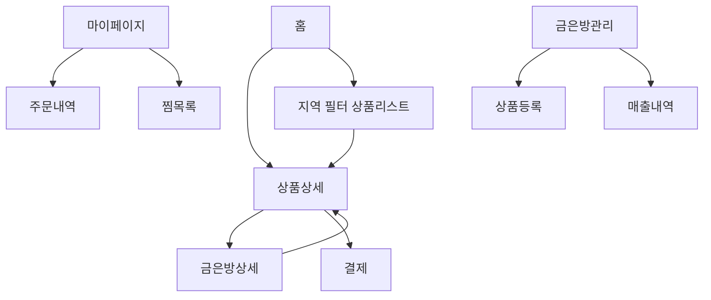

# 우동금 MVP 페이지별 와이어프레임 흐름도

## 서비스 개요
**우동금(Udonggeum)**은 동네 금은방들의 매물을 한눈에 볼 수 있는 로컬 주얼리 플랫폼입니다.  
사용자는 지역 기반으로 금은방 상품을 탐색하고, 상세정보와 결제까지 진행할 수 있습니다.

---

## 페이지 흐름 (FigJam 기반)

---

## 페이지별 세부 설명

### 🏠 홈 (Home)
- 상단 네비게이션: 홈 / 상품 / 장바구니 / 마이(로그인 상태에 따라 다름)
- 메인 배너: 금은방 프로모 이미지 슬라이더
- 검색/필터: 시/도, 구/군, 키워드 기반 검색
- 상품 카드 목록 (지역 필터 기반)

**UX 포인트:**
- 프로모 슬라이드 클릭 시 해당 금은방 페이지로 이동
- 로컬 중심의 UX, 시각적 강조를 통한 금은방 홍보

---

### 💍 상품상세 (Product Detail)
- 상품 이미지 갤러리 (썸네일 선택 가능)
- 가격 / 재질 / 무게 / 주문제작 여부 표시
- 금은방 정보 (로고, 위치, 연락처)
- [장바구니 담기] [바로 구매] 버튼

**UX 포인트:**
- 상세페이지에서 금은방 페이지로 자연스럽게 이동 가능
- “주문제작” 뱃지로 제작 소요 기간 인식 강화

---

### 🏪 금은방상세 (Store Detail)
- 금은방 로고 / 평점 / 소개 / 배송정책 / 연락처
- 등록된 상품 리스트
- 정렬 기능 (가격순, 인기순 등)

**UX 포인트:**
- 금은방별 브랜드 인지도 강화
- 매장별 프로모션 배너와 매물 한눈에 보기

---

### 🛒 장바구니 (Cart)
- 담긴 상품 리스트
- 수량 조절 및 삭제 기능
- 총 금액 및 결제 버튼

**UX 포인트:**
- “결제하기” 클릭 시 결제 페이지로 이동
- 간결한 구성으로 MVP 단계에 최적화

---

### 💳 결제 (Checkout)
- 배송지 정보 입력 폼
- 결제 수단 선택 (카드/계좌/간편결제 등)
- 주문 요약 카드

**UX 포인트:**
- 간단한 입력으로 결제 흐름 최소화
- 금은방별 배송정책 안내

---

### 👤 마이페이지 (My Page)
- 주문 내역
- 찜 목록
- 로그아웃 버튼

**UX 포인트:**
- 사용자 중심의 최소 정보 표시
- 추후 리뷰 기능 확장 여지 있음

---

### ⚙️ 금은방관리 (Store Admin)
- 상품 등록 폼 (이름, 가격, 재질, 설명, 이미지 업로드)
- 매출 내역(향후 추가 예정)

**UX 포인트:**
- 금은방 점주가 직접 매물 등록 가능
- 향후 입점 관리 기능으로 확장 가능

---

## UX 흐름 요약
1. 홈에서 금은방/상품 탐색  
2. 상품상세 → 장바구니 → 결제 → 마이페이지 흐름  
3. 점주는 금은방관리 페이지에서 상품 등록

---

_본 문서는 FigJam 기반 우동금 MVP 와이어프레임 구조를 Markdown으로 정리한 버전입니다._
