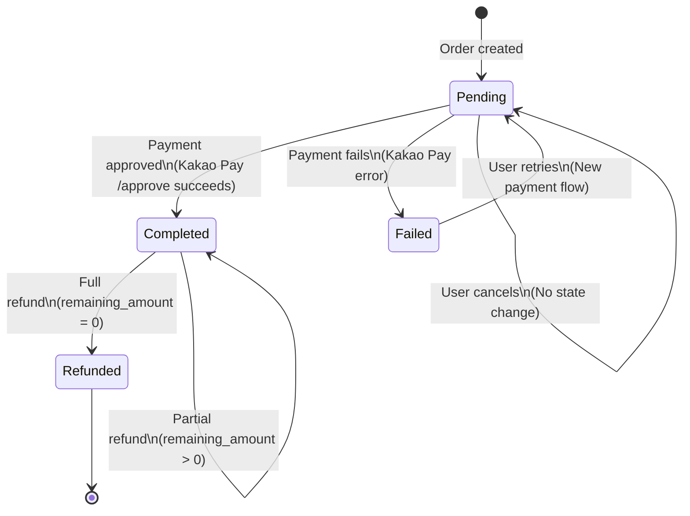

# Kakao Pay Payment Integration: Data Model

**Feature Branch**: `feat-kakao-pay`
**Created**: 2025-01-19
**Status**: Phase 1 - Design
**Related Documents**:
- [Feature Specification](./spec.md)
- [Technical Research](./research.md)
- [Integration Guide](../../docs/KAKAO_PAY_INTEGRATION.md)

---

## Table of Contents

1. [Overview](#overview)
2. [Entity Schemas](#entity-schemas)
3. [Request/Response Models](#requestresponse-models)
4. [Validation Rules](#validation-rules)
5. [State Transitions](#state-transitions)
6. [Entity Relationships](#entity-relationships)

---

## Overview

This document defines the complete data model for Kakao Pay payment integration, following the project's schema-first development approach using Zod for runtime validation and TypeScript type generation.

**Key Principles**:
- All types are derived from Zod schemas (single source of truth)
- Runtime validation at API boundaries (service layer)
- Immutable payment data after completion
- Strong type safety at compile-time and runtime

---

## Entity Schemas

### 1. Payment Entity (Extended Order Fields)

Since this is an MVP, payment data is stored as fields on the Order entity rather than a separate Payment table. This simplifies the data model while maintaining all necessary payment information.

```typescript
// Extension to existing OrderSchema in src/schemas/orders.ts

export const OrderSchema = z.object({
  // ... existing fields (id, user_id, total_amount, etc.)

  // Payment Fields (NEW)
  payment_status: z.enum(['pending', 'completed', 'failed', 'refunded'])
    .describe('Current payment status - drives UI badges and user actions'),

  payment_provider: z.string().optional()
    .describe('Payment provider name - always "kakaopay" when set'),

  payment_tid: z.string().optional()
    .describe('Kakao Pay transaction ID - generated during /ready, used for refunds'),

  payment_aid: z.string().optional()
    .describe('Kakao Pay approval ID - generated during /approve, proves payment success'),

  payment_method: z.enum(['CARD', 'MONEY']).optional()
    .describe('Payment method used - CARD (credit/debit) or MONEY (Kakao Money balance)'),

  payment_approved_at: z.string().datetime().nullable().optional()
    .describe('ISO 8601 timestamp of payment approval - null for pending payments'),

  // ... rest of existing fields
});

export type Order = z.infer<typeof OrderSchema>;
```

**Field Details**:

| Field | Type | Required | Immutable After Completion | Purpose |
|-------|------|----------|---------------------------|---------|
| `payment_status` | `enum` | ✅ Yes | ❌ No (can change to refunded) | Drives UI display, determines available actions |
| `payment_provider` | `string` | ❌ No | ✅ Yes | Identifies payment gateway (always "kakaopay" for now) |
| `payment_tid` | `string` | ❌ No | ✅ Yes | Transaction ID for refund API calls |
| `payment_aid` | `string` | ❌ No | ✅ Yes | Approval ID proves payment succeeded |
| `payment_method` | `enum` | ❌ No | ✅ Yes | User's chosen payment method |
| `payment_approved_at` | `datetime` | ❌ No | ✅ Yes | Audit trail, receipt generation |

**Validation Rules**:
- All payment fields (except `payment_status`) are `optional` because orders start with `payment_status: 'pending'` and no payment data
- When `payment_status` is `'completed'`, the following must be present:
  - `payment_provider` (string, non-empty)
  - `payment_tid` (string, non-empty)
  - `payment_aid` (string, non-empty)
  - `payment_method` (CARD or MONEY)
  - `payment_approved_at` (valid ISO 8601 datetime)
- When `payment_status` is `'pending'`, `'failed'`, or `'refunded'`, payment fields may be partially populated

---

## Request/Response Models

### 2. PaymentReadyRequest

Request to initiate Kakao Pay payment flow.

```typescript
export const PaymentReadyRequestSchema = z.object({
  order_id: z.number()
    .int('Order ID must be an integer')
    .positive('Order ID must be positive'),
});

export type PaymentReadyRequest = z.infer<typeof PaymentReadyRequestSchema>;
```

**Example**:
```json
{
  "order_id": 123
}
```

**Validation**:
- `order_id` must be a positive integer
- Backend validates:
  - Order exists
  - Order belongs to authenticated user
  - Order payment status is `'pending'` (not already completed)

---

### 3. PaymentReadyResponse

Response from `/ready` endpoint containing Kakao Pay redirect URLs.

```typescript
export const PaymentReadyDataSchema = z.object({
  tid: z.string()
    .min(1, 'Transaction ID cannot be empty')
    .describe('Kakao Pay transaction ID - store for approval call'),

  next_redirect_pc_url: z.string()
    .url('Must be a valid URL')
    .describe('Redirect URL for desktop/laptop browsers'),

  next_redirect_mobile_url: z.string()
    .url('Must be a valid URL')
    .describe('Redirect URL for mobile web browsers'),

  next_redirect_app_url: z.string()
    .url('Must be a valid URL')
    .describe('Redirect URL for in-app browsers (KakaoTalk, etc.)'),

  android_app_scheme: z.string()
    .describe('Deep link scheme for native Android apps'),

  ios_app_scheme: z.string()
    .describe('Deep link scheme for native iOS apps'),
});

export const PaymentReadyResponseSchema = z.object({
  message: z.string(),
  data: PaymentReadyDataSchema,
});

export type PaymentReadyData = z.infer<typeof PaymentReadyDataSchema>;
export type PaymentReadyResponse = z.infer<typeof PaymentReadyResponseSchema>;
```

**Example**:
```json
{
  "message": "Payment initiated successfully",
  "data": {
    "tid": "T91ca88177920788c115",
    "next_redirect_pc_url": "https://online-payment.kakaopay.com/mockup/bridge/pc/...",
    "next_redirect_mobile_url": "https://online-payment.kakaopay.com/mockup/bridge/mobile-web/...",
    "next_redirect_app_url": "https://online-payment.kakaopay.com/mockup/bridge/mobile-app/...",
    "android_app_scheme": "kakaotalk://kakaopay/pg?url=...",
    "ios_app_scheme": "kakaotalk://kakaopay/pg?url=..."
  }
}
```

**Usage Pattern**:
```typescript
// Frontend selects appropriate URL based on device
const isMobile = /iPhone|iPad|iPod|Android/i.test(navigator.userAgent);
const redirectUrl = isMobile
  ? response.data.next_redirect_mobile_url
  : response.data.next_redirect_pc_url;

window.location.href = redirectUrl;
```

---

### 4. PaymentApprovalResponse

Response from `/success` callback after Kakao Pay approval.

```typescript
export const PaymentApprovalDataSchema = z.object({
  order_id: z.number()
    .int()
    .positive()
    .describe('Order ID that was paid'),

  aid: z.string()
    .min(1, 'Approval ID cannot be empty')
    .describe('Kakao Pay approval ID - proof of payment'),

  tid: z.string()
    .min(1, 'Transaction ID cannot be empty')
    .describe('Kakao Pay transaction ID - matches TID from /ready'),

  total_amount: z.number()
    .nonnegative('Amount cannot be negative')
    .describe('Total amount paid in KRW (Korean Won)'),

  payment_method: z.enum(['CARD', 'MONEY'])
    .describe('Payment method - CARD (credit/debit card) or MONEY (Kakao Money)'),

  approved_at: z.string()
    .datetime('Must be valid ISO 8601 datetime')
    .describe('Timestamp when payment was approved'),
});

export const PaymentApprovalResponseSchema = z.object({
  message: z.string(),
  data: PaymentApprovalDataSchema,
});

export type PaymentApprovalData = z.infer<typeof PaymentApprovalDataSchema>;
export type PaymentApprovalResponse = z.infer<typeof PaymentApprovalResponseSchema>;
```

**Example**:
```json
{
  "message": "Payment completed successfully",
  "data": {
    "order_id": 123,
    "aid": "A91ca930315e2b03efce",
    "tid": "T91ca901315e2b03efcd",
    "total_amount": 50000,
    "payment_method": "MONEY",
    "approved_at": "2025-01-19T14:30:00Z"
  }
}
```

**Data Flow**:
```
1. User completes payment on Kakao Pay page
2. Kakao Pay redirects to: /api/v1/payments/kakao/success?order_id=123&pg_token=abc
3. Backend calls Kakao Pay /approve API
4. Backend returns PaymentApprovalResponse to frontend
5. Frontend displays success page + updates cache
```

---

### 5. PaymentStatusResponse

Response from `/status/:orderID` endpoint for checking payment state.

```typescript
export const PaymentStatusDataSchema = z.object({
  order_id: z.number()
    .int()
    .positive(),

  payment_status: z.enum(['pending', 'completed', 'failed', 'refunded'])
    .describe('Current payment status'),

  payment_provider: z.string()
    .optional()
    .describe('Payment provider name - present when payment initiated'),

  payment_tid: z.string()
    .optional()
    .describe('Transaction ID - present when payment initiated'),

  payment_aid: z.string()
    .optional()
    .describe('Approval ID - present when payment completed'),

  payment_method: z.enum(['CARD', 'MONEY'])
    .optional()
    .describe('Payment method - present when payment completed'),

  payment_approved_at: z.string()
    .datetime()
    .nullable()
    .optional()
    .describe('Approval timestamp - present when payment completed'),

  total_amount: z.number()
    .nonnegative()
    .describe('Order total amount'),
});

export const PaymentStatusResponseSchema = z.object({
  message: z.string(),
  data: PaymentStatusDataSchema,
});

export type PaymentStatusData = z.infer<typeof PaymentStatusDataSchema>;
export type PaymentStatusResponse = z.infer<typeof PaymentStatusResponseSchema>;
```

**Example - Pending**:
```json
{
  "message": "Payment status retrieved successfully",
  "data": {
    "order_id": 123,
    "payment_status": "pending",
    "total_amount": 50000
  }
}
```

**Example - Completed**:
```json
{
  "message": "Payment status retrieved successfully",
  "data": {
    "order_id": 123,
    "payment_status": "completed",
    "payment_provider": "kakaopay",
    "payment_tid": "T91ca901315e2b03efcd",
    "payment_aid": "A91ca930315e2b03efce",
    "payment_method": "MONEY",
    "payment_approved_at": "2025-01-19T14:30:00Z",
    "total_amount": 50000
  }
}
```

**Usage**:
- Frontend calls before showing payment button (prevent duplicate payments)
- Backend returns minimal data for pending, full data for completed
- React Query caches with 10-minute stale time (payment status rarely changes)

---

### 6. PaymentRefundRequest

Request to refund/cancel a completed payment.

```typescript
export const PaymentRefundRequestSchema = z.object({
  cancel_amount: z.number()
    .positive('Refund amount must be greater than zero')
    .describe('Amount to refund in KRW - can be partial or full'),
});

export type PaymentRefundRequest = z.infer<typeof PaymentRefundRequestSchema>;
```

**Example - Full Refund**:
```json
{
  "cancel_amount": 50000
}
```

**Example - Partial Refund**:
```json
{
  "cancel_amount": 10000
}
```

**Validation**:
- `cancel_amount` must be positive
- Backend validates:
  - `cancel_amount` ≤ `total_amount - previous_refunds`
  - Payment status is `'completed'` (can't refund pending/failed)

---

### 7. PaymentRefundResponse

Response from `/refund` endpoint after successful refund.

```typescript
export const PaymentRefundDataSchema = z.object({
  order_id: z.number()
    .int()
    .positive(),

  tid: z.string()
    .min(1)
    .describe('Original transaction ID'),

  canceled_amount: z.number()
    .nonnegative()
    .describe('Amount refunded in this request'),

  remaining_amount: z.number()
    .nonnegative()
    .describe('Remaining amount not refunded (for partial refunds)'),

  canceled_at: z.string()
    .datetime()
    .describe('Timestamp when refund was processed'),
});

export const PaymentRefundResponseSchema = z.object({
  message: z.string(),
  data: PaymentRefundDataSchema,
});

export type PaymentRefundData = z.infer<typeof PaymentRefundDataSchema>;
export type PaymentRefundResponse = z.infer<typeof PaymentRefundResponseSchema>;
```

**Example - Full Refund**:
```json
{
  "message": "Payment cancelled successfully",
  "data": {
    "order_id": 123,
    "tid": "T91ca901315e2b03efcd",
    "canceled_amount": 50000,
    "remaining_amount": 0,
    "canceled_at": "2025-01-19T15:00:00Z"
  }
}
```

**Example - Partial Refund**:
```json
{
  "message": "Payment partially refunded",
  "data": {
    "order_id": 123,
    "tid": "T91ca901315e2b03efcd",
    "canceled_amount": 10000,
    "remaining_amount": 40000,
    "canceled_at": "2025-01-19T15:00:00Z"
  }
}
```

**Post-Refund State**:
- If `remaining_amount === 0`: Order `payment_status` changes to `'refunded'`
- If `remaining_amount > 0`: Order `payment_status` remains `'completed'` (partial refund)

---

### 8. PaymentCallbackQuery

Query parameters from Kakao Pay redirect callbacks.

```typescript
// Success callback
export const PaymentSuccessCallbackSchema = z.object({
  order_id: z.string()
    .transform((val) => parseInt(val, 10))
    .pipe(z.number().int().positive())
    .describe('Order ID that was paid'),

  pg_token: z.string()
    .min(1, 'pg_token is required')
    .describe('Single-use token for payment approval'),
});

export type PaymentSuccessCallback = z.infer<typeof PaymentSuccessCallbackSchema>;

// Failure callback
export const PaymentFailCallbackSchema = z.object({
  order_id: z.string()
    .transform((val) => parseInt(val, 10))
    .pipe(z.number().int().positive()),

  error_msg: z.string()
    .optional()
    .describe('Error message from Kakao Pay'),
});

export type PaymentFailCallback = z.infer<typeof PaymentFailCallbackSchema>;

// Cancel callback
export const PaymentCancelCallbackSchema = z.object({
  order_id: z.string()
    .transform((val) => parseInt(val, 10))
    .pipe(z.number().int().positive()),
});

export type PaymentCancelCallback = z.infer<typeof PaymentCancelCallbackSchema>;
```

**URL Examples**:
```
Success:  /payment/success?order_id=123&pg_token=abc123def456
Fail:     /payment/fail?order_id=123&error_msg=Insufficient%20funds
Cancel:   /payment/cancel?order_id=123
```

**Usage**:
```typescript
// In PaymentSuccessPage.tsx
const [searchParams] = useSearchParams();
const orderId = searchParams.get('order_id');
const pgToken = searchParams.get('pg_token');

// Validate with Zod
const validated = PaymentSuccessCallbackSchema.parse({ order_id: orderId, pg_token: pgToken });
```

---

## Validation Rules

### Order-Level Validation

```typescript
// Custom validator: Ensure completed payments have all required fields
export const validateCompletedPayment = (order: Order): boolean => {
  if (order.payment_status === 'completed') {
    return !!(
      order.payment_provider &&
      order.payment_tid &&
      order.payment_aid &&
      order.payment_method &&
      order.payment_approved_at
    );
  }
  return true;
};

// Usage in service layer
const order = OrderSchema.parse(apiResponse);
if (!validateCompletedPayment(order)) {
  throw new ValidationError('Completed payment missing required fields');
}
```

### Request Validation Rules

| Endpoint | Validation |
|----------|-----------|
| `POST /ready` | `order_id` must be positive integer; order must exist, belong to user, and have `payment_status: 'pending'` |
| `GET /success` | `order_id` must be positive integer; `pg_token` must be non-empty string |
| `GET /fail` | `order_id` must be positive integer; `error_msg` is optional |
| `GET /cancel` | `order_id` must be positive integer |
| `GET /status/:orderID` | `:orderID` must be positive integer; order must belong to authenticated user |
| `POST /refund` | `cancel_amount` must be positive; ≤ remaining amount; payment must be completed |

### Security Validation

```typescript
// Backend must validate:
// 1. User owns the order
export const validateOrderOwnership = (orderId: number, userId: number): Promise<boolean> => {
  // SELECT user_id FROM orders WHERE id = orderId
  // RETURN user_id === userId
};

// 2. pg_token is valid and not expired (15-minute TTL)
export const validatePgToken = (token: string): boolean => {
  // Kakao Pay validates this - backend just passes it through
  // Single-use: Kakao Pay rejects duplicate approval attempts
  return token.length > 0;
};

// 3. Payment not already processed
export const validatePaymentNotProcessed = (order: Order): boolean => {
  return order.payment_status !== 'completed' && order.payment_status !== 'refunded';
};
```

---

## State Transitions

### Payment Status State Machine



**State Descriptions**:

| State | Description | User Actions | Backend State |
|-------|-------------|--------------|---------------|
| `pending` | Order created, payment not initiated or canceled | Can click "결제하기" to (re)start payment | No payment data |
| `completed` | Payment approved by Kakao Pay | View receipt, request refund (admin) | Has TID, AID, approval timestamp |
| `failed` | Payment attempt failed (insufficient funds, etc.) | Can retry payment | May have TID (if initiated) |
| `refunded` | Payment fully refunded | View refund details | Has TID, AID, refund timestamp |

**Transitions**:

1. **Pending → Completed** (Happy Path)
   - Trigger: User completes payment on Kakao Pay page
   - Backend: Calls `/approve` API, updates order with AID, timestamp
   - Frontend: Redirects to success page, shows payment details

2. **Pending → Failed**
   - Trigger: Kakao Pay returns failure callback
   - Backend: Logs error, order remains `pending` for retry
   - Frontend: Shows error page, offers "다시 결제하기" button

3. **Pending → Pending** (Cancellation)
   - Trigger: User clicks cancel/back on Kakao Pay page
   - Backend: No state change (order remains `pending`)
   - Frontend: Shows cancellation page, offers retry

4. **Completed → Refunded** (Full Refund)
   - Trigger: Admin initiates refund via backend API
   - Backend: Calls Kakao Pay `/cancel` API, updates status
   - Frontend: Shows refund status in order history

5. **Completed → Completed** (Partial Refund)
   - Trigger: Admin refunds portion of payment
   - Backend: Calls `/cancel` with partial amount, status remains `completed`
   - Frontend: Shows remaining amount, refund history

6. **Failed → Pending** (Retry)
   - Trigger: User clicks "다시 결제하기" on error page
   - Backend: Generates new TID (fresh payment initiation)
   - Frontend: Redirects to Kakao Pay again

**Immutability Rules**:
- Once `payment_status` is `completed` or `refunded`, core payment data (TID, AID, timestamp) NEVER changes
- `payment_status` can transition from `completed` to `refunded`, but payment details remain unchanged
- Each retry creates a NEW TID (fresh payment flow, not re-using old TID)

---

## Entity Relationships

### ER Diagram

```
┌─────────────┐
│    User     │
│             │
│  id (PK)    │
│  email      │
│  name       │
└──────┬──────┘
       │
       │ 1:N
       │
┌──────▼──────────────────────────────────────────┐
│                   Order                         │
│                                                 │
│  id (PK)                                        │
│  user_id (FK) ───────────────────────────┐     │
│  total_amount                             │     │
│  fulfillment_type                         │     │
│  shipping_address                         │     │
│  pickup_store_id (FK) ──────────┐        │     │
│                                  │        │     │
│  // Payment Fields               │        │     │
│  payment_status ◄────────────────┼────────┼─── State Machine
│  payment_provider                │        │     │
│  payment_tid                     │        │     │
│  payment_aid                     │        │     │
│  payment_method                  │        │     │
│  payment_approved_at             │        │     │
│                                  │        │     │
│  created_at                      │        │     │
│  updated_at                      │        │     │
└──────┬───────────────────────────┼────────┼─────┘
       │                           │        │
       │ 1:N                       │        │
       │                           │        │
┌──────▼──────────┐        ┌───────▼──────┐│
│   OrderItem     │        │    Store     ││
│                 │        │              ││
│  id (PK)        │        │  id (PK)     ││
│  order_id (FK)  │        │  name        ││
│  product_id (FK)│        │  address     ││
│  store_id (FK) ─┼────────►              ││
│  quantity       │        └──────────────┘│
│  price          │                        │
│  option_snapshot│                        │
└─────────────────┘                        │
                                           │
                    User owns Order ───────┘
```

**Relationships**:

1. **User → Order** (1:N)
   - One user can have many orders
   - Each order belongs to exactly one user
   - Foreign key: `Order.user_id → User.id`

2. **Order → OrderItem** (1:N)
   - One order contains many items
   - Each item belongs to exactly one order
   - Foreign key: `OrderItem.order_id → Order.id`

3. **Store → Order** (1:N for pickup)
   - One store can have many pickup orders
   - Each pickup order designates one store
   - Foreign key: `Order.pickup_store_id → Store.id` (optional)

4. **Order → Payment Data** (1:1 embedded)
   - Payment data is stored as fields on Order (not separate table)
   - One order has one payment record
   - Lifecycle: `payment_status` drives which fields are populated

**Cascading Rules**:
- Deleting User: Cascade delete orders (or mark inactive in production)
- Deleting Order: Cascade delete order items
- Deleting Store: Block if pickup orders exist (integrity constraint)

**Indexes** (Backend concern, documented for completeness):
```sql
-- Primary indexes
CREATE INDEX idx_orders_user_id ON orders(user_id);
CREATE INDEX idx_orders_payment_status ON orders(payment_status);
CREATE INDEX idx_orders_payment_tid ON orders(payment_tid);

-- Composite for common queries
CREATE INDEX idx_orders_user_status ON orders(user_id, payment_status);

-- Order item lookups
CREATE INDEX idx_order_items_order_id ON order_items(order_id);
```

---

## Schema Integration

### Complete Schema Export

```typescript
// src/schemas/payment.ts (NEW FILE)

import { z } from 'zod';

// ============================================================================
// REQUEST SCHEMAS
// ============================================================================

export const PaymentReadyRequestSchema = z.object({
  order_id: z.number().int().positive(),
});

export const PaymentRefundRequestSchema = z.object({
  cancel_amount: z.number().positive(),
});

// ============================================================================
// RESPONSE DATA SCHEMAS
// ============================================================================

export const PaymentReadyDataSchema = z.object({
  tid: z.string().min(1),
  next_redirect_pc_url: z.string().url(),
  next_redirect_mobile_url: z.string().url(),
  next_redirect_app_url: z.string().url(),
  android_app_scheme: z.string(),
  ios_app_scheme: z.string(),
});

export const PaymentApprovalDataSchema = z.object({
  order_id: z.number().int().positive(),
  aid: z.string().min(1),
  tid: z.string().min(1),
  total_amount: z.number().nonnegative(),
  payment_method: z.enum(['CARD', 'MONEY']),
  approved_at: z.string().datetime(),
});

export const PaymentStatusDataSchema = z.object({
  order_id: z.number().int().positive(),
  payment_status: z.enum(['pending', 'completed', 'failed', 'refunded']),
  payment_provider: z.string().optional(),
  payment_tid: z.string().optional(),
  payment_aid: z.string().optional(),
  payment_method: z.enum(['CARD', 'MONEY']).optional(),
  payment_approved_at: z.string().datetime().nullable().optional(),
  total_amount: z.number().nonnegative(),
});

export const PaymentRefundDataSchema = z.object({
  order_id: z.number().int().positive(),
  tid: z.string().min(1),
  canceled_amount: z.number().nonnegative(),
  remaining_amount: z.number().nonnegative(),
  canceled_at: z.string().datetime(),
});

// ============================================================================
// RESPONSE WRAPPER SCHEMAS
// ============================================================================

export const PaymentReadyResponseSchema = z.object({
  message: z.string(),
  data: PaymentReadyDataSchema,
});

export const PaymentApprovalResponseSchema = z.object({
  message: z.string(),
  data: PaymentApprovalDataSchema,
});

export const PaymentStatusResponseSchema = z.object({
  message: z.string(),
  data: PaymentStatusDataSchema,
});

export const PaymentRefundResponseSchema = z.object({
  message: z.string(),
  data: PaymentRefundDataSchema,
});

export const PaymentErrorResponseSchema = z.object({
  message: z.string(),
  error: z.string().optional(),
});

// ============================================================================
// CALLBACK QUERY SCHEMAS
// ============================================================================

export const PaymentSuccessCallbackSchema = z.object({
  order_id: z.string().transform((val) => parseInt(val, 10)).pipe(z.number().int().positive()),
  pg_token: z.string().min(1),
});

export const PaymentFailCallbackSchema = z.object({
  order_id: z.string().transform((val) => parseInt(val, 10)).pipe(z.number().int().positive()),
  error_msg: z.string().optional(),
});

export const PaymentCancelCallbackSchema = z.object({
  order_id: z.string().transform((val) => parseInt(val, 10)).pipe(z.number().int().positive()),
});

// ============================================================================
// TYPE EXPORTS
// ============================================================================

export type PaymentReadyRequest = z.infer<typeof PaymentReadyRequestSchema>;
export type PaymentRefundRequest = z.infer<typeof PaymentRefundRequestSchema>;

export type PaymentReadyData = z.infer<typeof PaymentReadyDataSchema>;
export type PaymentApprovalData = z.infer<typeof PaymentApprovalDataSchema>;
export type PaymentStatusData = z.infer<typeof PaymentStatusDataSchema>;
export type PaymentRefundData = z.infer<typeof PaymentRefundDataSchema>;

export type PaymentReadyResponse = z.infer<typeof PaymentReadyResponseSchema>;
export type PaymentApprovalResponse = z.infer<typeof PaymentApprovalResponseSchema>;
export type PaymentStatusResponse = z.infer<typeof PaymentStatusResponseSchema>;
export type PaymentRefundResponse = z.infer<typeof PaymentRefundResponseSchema>;
export type PaymentErrorResponse = z.infer<typeof PaymentErrorResponseSchema>;

export type PaymentSuccessCallback = z.infer<typeof PaymentSuccessCallbackSchema>;
export type PaymentFailCallback = z.infer<typeof PaymentFailCallbackSchema>;
export type PaymentCancelCallback = z.infer<typeof PaymentCancelCallbackSchema>;

// ============================================================================
// CUSTOM VALIDATORS
// ============================================================================

export const validateCompletedPayment = (order: {
  payment_status: string;
  payment_provider?: string;
  payment_tid?: string;
  payment_aid?: string;
  payment_method?: string;
  payment_approved_at?: string | null;
}): boolean => {
  if (order.payment_status === 'completed') {
    return !!(
      order.payment_provider &&
      order.payment_tid &&
      order.payment_aid &&
      order.payment_method &&
      order.payment_approved_at
    );
  }
  return true;
};
```

### Update to Existing Orders Schema

```typescript
// src/schemas/orders.ts (UPDATE)

// Add payment status enum export
export const PaymentStatusEnum = z.enum(['pending', 'completed', 'failed', 'refunded']);
export type PaymentStatus = z.infer<typeof PaymentStatusEnum>;

// Update OrderSchema with payment fields
export const OrderSchema = z.object({
  // ... existing fields

  // Payment fields (ADD THESE)
  payment_status: PaymentStatusEnum,
  payment_provider: z.string().optional(),
  payment_tid: z.string().optional(),
  payment_aid: z.string().optional(),
  payment_method: z.enum(['CARD', 'MONEY']).optional(),
  payment_approved_at: z.string().datetime().nullable().optional(),

  // ... rest of existing fields
});
```

---

## Revision History

| Version | Date | Changes |
|---------|------|---------|
| 1.0.0 | 2025-01-19 | Initial data model design - all schemas defined |

---

**Created by**: Claude
**Reviewed by**: [Pending]
**Approved by**: [Pending]
